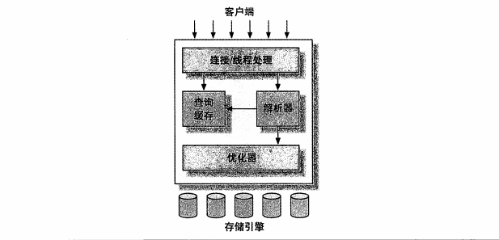

#第1章 MySQL架构与历史
##1.1 MySQL逻辑架构

最上层的服务并不是MySQL所独有的，大多数基于网络的客户端/服务器的工具或者服务都有类似的架构。比如连接处理、授权认证、安全等等。

第二层架构是MySQL比较有意思的部分。大多数MySQL的核心服务功能都在这一层，包括查询解析、分析、优化、缓存以及所有的内置函数，所有跨存储引擎的功能都在这一层实现：存储过程、触发器、视图等。

第三层包含了存储引擎。存储引擎负责MySQL中数据的存储和提取。服务器通过API与存储引擎进行通信。这些接口屏蔽了不同存储引擎之间的差异。

##1.2 并发控制
无论何时，只要有多个查询需要在同一时刻修改数据，都会产生并发控制的问题。

###1.2.1 读写锁
在处理并发度或者写时，可以通过实现一个由两种类型的锁组成的锁系统来解决问题。这两种类型的锁通常被称为共享锁和排它锁，也叫读锁和写锁。读锁是共享的，或者说是相互不阻塞的。多个客户在同一时刻可以同时读取同一个资源，而互不干扰。写锁则是排他的，也就是说一个写锁会阻塞其他的写锁和读锁，这是出于安全策略的考虑，只有这样，才能确保在给定的时间里，只有一个用户能执行写入，并防止其他用户读取正在写入的同一资源。

###1.2.2 锁粒度
一种提高共享资源并发性的方式就是让锁定对象更有选择性。尽量只锁定需要修改的部分数据，而不是所有的资源。更理想的方式是，只会对修改的数据片进行精确的锁定。任何时候，在给定的资源上，锁定的数据量越少，则系统的并发程度越高，只要相互之间不发生冲突即可。

问题是加锁也需要消耗资源。锁的各种操作，包括获得锁、检查锁是否已经解除、释放锁等，都会增加系统的开销。如果系统花费大量的时间来管理锁，而不是存取数据，那么系统的性能可能会因此受到影响。

所谓的锁策略，就是在锁的开销和数据的安全性之间寻求平衡，这种平衡当然也会影响到性能。大多数商业数据库系统没有提供更多的选择，一般都是在表上施加行级锁，并以各种复杂的方式来实现，以便在锁比较多的情况下尽可能地提供更好的性能。下面介绍两种最重要的锁策略：

####表锁（table lock）
表锁是MySQL中最基本的锁策略，并且是开销最小的策略。表锁会锁定整张表。一个用户在对表进行写操作（插入、删除、更新等）前，需要先获得写锁，这会阻塞其他用户对该表的所有读写操作。只有没有写锁时，其他读取的用户才能获得读锁，读锁之间是不相互阻塞的。

在特定的场景中，表锁也可能有良好的性能。例如，READ LOCAL表锁支持某些类型的并发写操作。另外，写锁也比读锁有更高的优先级，因此一个写锁请求可能会被插入到读锁队列的前面。

####行级锁（row lock）
行级锁可以最大程度地支持并发处理（同时也带来了最大的锁开销）。

##1.3 事务
事务就是一组原子性的SQL查询，或者说一个独立的工作单元。ACID表示原子性、一致性、隔离性和持久性。一个运行良好的事务处理系统，必须具备这些标准特征。

- **原子性（atomicity）** 一个事务必须被视为一个不可分割的最小工作单元，整个事务中的所有操作要么全部提交成功，要么全部失败回滚，对于一个事务来说，不可能只执行其中的一部分操作，这就是事务的原子性。
- **一致性（consistency）** 数据库总是从一个一致性的状态转换到另外一个一致性的状态。
- **隔离性（isolation）** 通常来说，一个事务所做的修改在最终提交以前，对其他事务是不可见的。
- **持久性（durability）** 一旦事务提交，则其所做的修改就会永久保存到数据库中。此时即使系统崩溃，修改的数据也不会丢失。

###1.3.1 隔离级别
隔离性其实比想象的要复杂。在SQL标准中定义了四种隔离级别，每一种级别都规定了一个事务中所做的修改，哪些在事务内和事务间是可见的，哪些是不可见的。较低级别的隔离通常可以执行更高的并发，系统的开销也更低。

- **READ UNCOMMITTED（未提交读）** 在READ UNCOMMITTED级别，事务中的修改，即使没有提交，对其它事务也都是可见的。事务可以读取未提交的数据，这也被称为脏读（Dirty Read）。这个级别会导致很多问题，从性能上来说，READ UNCOMMITTED不会比其他的级别好太多，但却缺乏其他级别的很多好处。
- **READ COMMITTED（提交读）** 大多数数据库系统的默认隔离级别都是READ COMMITTED（但MySQL不是）。READ COMMITTED满足前面提到的隔离性的简单定义：一个事务开始时，只能“看见”已经提交的事务所做的修改。换句话说，一个事务从开始直到提交之前，所做的任何修改对其它事务都是不可见的。这个级别有时候也叫做不可重复读，因为两次执行同样的查询，可能会得到不一样的结果。
- **REPEATABLE READ（可重复读）** REPEATABLE READ解决了脏读的问题。该级别保证了在同一个事务中多次读取同样记录的结果是一致的。但是理论上，可重复读隔离级别还是无法解决另外一个幻读的问题。所谓幻读，指的是当某个事务在读取某个范围内的记录时，另外一个事务又在该范围内插入了新的记录，当之前的事务再次读取该范围的记录时，会产生幻行。InnoDB和XtraDB存储引擎通过多版本并发控制解决了幻读的问题。可重复读是MySQL的默认事务隔离级别。
- **SERIALIZABLE（可串行化）** SERIALIZABLE是最高的隔离级别。它通过强制事务串行执行，避免了前面说的幻读的问题。简单来说，SERIALIZABLE会在读取的每一行数据上都加锁，所以可能导致大量的超时和锁争用的问题。实际应用中也很少用到这个隔离级别，只有在非常需要确保数据的一致性而且可以接受没有并发的情况下，才考虑采用该级别。

###1.3.2 死锁
死锁是指两个或者多个事务在同一资源上相互占用，并请求锁定对方占用的资源，从而导致恶性循环的现象。当多个事务试图以不同的顺序锁定资源时，就可能会产生死锁。多个事务同时锁定同一个资源时，也会产生死锁。

为了解决这种问题，数据库系统实现了各种死锁检测和死锁超时机制。越复杂的系统，比如InnoDB存储引擎，越能检测到死锁的循环依赖，并立即返回一个错误。这种解决方式很有效，否则死锁会导致出现非常慢的查询。还有一种解决方式，就是当查询的时候达到锁等待超时的设定后放弃锁请求，这种方式通常来说不太好。InnoDB目前处理死锁的方法是，将持有最少行级排他锁的事务进行回滚。

锁的行为和顺序是和存储引擎相关的。以相同的顺序执行语句，有些存储引擎会产生死锁，有些则不会。死锁的产生有双重原因：有些是因为真正的数据冲突，这种情况通常很难避免，但有些则完全是由于存储引擎的实现方式导致的。

死锁发生以后，只有部分或者完全回滚其中一个事务，才能打破死锁。对于事务型的系统，这是无法避免的，所以应用程序在设计时必须考虑如何处理死锁。大多数情况下只需要重新执行因死锁回滚的事务即可。

###1.3.3 事务日志
事务日志可以帮助提高事务的效率。使用事务日志，存储引擎在修改表的数据时只需要修改其内存拷贝，再把该修改行为记录到持久在硬盘上的事务日志中，而不用每次都将修改的数据本身持久到磁盘。事务日志采用的是追加的方式，因此写日志的操作时磁盘上一小块区域内的顺序I/O，而不像随机I/O需要在磁盘的多个地方移动磁头，所以采用事务日志的方式相对来说要快得多。事务日志持久以后，内存中被修改的数据在后台可以慢慢地刷回到磁盘。目前大多数存储引擎都是这样实现的，我们通常称之为预写式日志（Write-Ahead Logging），修改数据需要写两次磁盘。

如果数据的修改已经记录到事务日志并持久化，但数据本身还没有协会磁盘，此时系统崩溃，存储引擎在重启时能够自动恢复这部分修改的数据。

###1.3.4 MySQL中的事务
MySQL提供了两种事务型的存储引擎：InnoDB和NDB Cluster。另外还有一些第三方存储引擎也支持事务，比较知名的包括XtraDB和PBXT。

####自动提交（AUTOCOMMIT）
MySQL默认采用自动提交模式。也就是说，如果不是显式地开始一个事务，则每个查询都被当做一个事务执行提交操作。在当前连接中，可以通过设置AUTOCOMMIT变量来启用或者禁用自动提交模式。当AUTOCOMMIT=0时，所有的查询都是在一个事务中，直到显式地执行COMMIT提交或者ROOLBACK回滚，该事务结束，同时又开始了另一个新事务。修改AUTOCOMMIT对非事务型的表，比如MyISAM或者内存表，不会有任何影响。

另外还有一些命令，在执行之前会强制执行COMMIT提交当前的活动事务。

MySQL可以通过执行SET TRANSACTION ISOLATION LEVEL命令来设置隔离级别。新的隔离级别会在下一个事务开始的时候生效。可以在配置文件中设置整个数据库的隔离级别，也可以只改变当前会话的隔离级别。

####在事务中混合使用存储引擎
MySQL服务器层不管理事务，事务是由下层的存储引擎实现的。所以在同一个事务中，使用多种存储引擎是不可靠的。

如果在事务中混合使用了事务型和非事务型的表，在正常提交的情况下不会有什么问题。但如果该事务需要回滚，非事务型的表上的变更就无法撤消，这会导致数据库处于不一致的状态，这种情况很难修复，事务的最终结果将无法确定。

####隐式和显式锁定
InnoDB采用的是两阶段锁定协议（two-phase locking protocol）。在事务执行过程中，随时都可以执行锁定，锁只有在执行COMMIT或者ROLLBACK的时候才会释放，并且所有的锁是在同一时刻被释放。前面描述的锁定都是隐式锁定，InnoDB会根据隔离级别在需要的时候自动加锁。

另外，InnoDB也支持通过特定的语句进行显示锁定，这些语句不属于SQL规范：

- SELECT ... LOCK IN SHARE MODE
- SELECT ... FOR UPDATE

MySQL也支持LOCK TABLES和UNLOCK TABLES语句，这是在服务器层实现的，和存储引擎无关。

##1.4 多版本并发控制
MySQL的大多数事务型存储引擎实现的都不是简单的行级锁。基于提升并发性能的考虑，它们一般都同时实现了多版本并发控制（MVCC）。

可以认为MVCC是行级锁的一个变种，但是它在很多情况下避免了加锁操作，因此开销更低。虽然实现机制有所不同，但大都实现了非阻塞的读操作，写操作也只锁定必要的行。

MVCC的实现，是通过保存数据在某个时间点的快照来实现的。也就是说，不管需要执行多长时间，每个事物看到的数据都是一致的。根据事物开始的时间不同，每个事务对同一张表，同一时刻看到的数据可能是不一样的。

InnoDB的MVCC，是通过在每行记录后面保存两个隐藏的列来实现的。这两个列，一个保存了行的创建时间，一个保存行的过期时间（或删除时间）。当然存储的并不是实际的时间值，而是系统版本号。每开始一个新的事物，系统版本号都会自动递增。事务开始时刻的系统版本号会作为事务的版本号，用来和查询到的每行记录的版本号进行比较。下面看一下在REPEATABLE READ隔离级别下，MVCC具体是如何操作的。

####SELECT
InnoDB会根据以下两个条件检查每行记录：

- InnoDB只查找版本早于当前事务版本的数据行（也就是，行的系统版本号小于或等于事务的系统版本号），这样可以确保事务读取的行，要么是在事务开始前已经存在的，要么是事务自身插入或者修改过的。
- 行的删除版本要么未定义，要么大于当前事务版本号。这可以确保事务读取到的行，在事务开始之前未被删除。

只有符合上述两个条件的记录，才能返回作为查询结果。

####INSERT
InnoDB为新插入的每一行保存当前系统版本号作为行版本号。

####DELETE
InnoDB为删除的每一行保存当前版本号作为行删除标识。

####UPDATE
InnoDB为插入一行新纪录，保存当前系统版本号作为行版本号，同时保存当前系统版本号到原来的行作为行删除标识。

保存这两个额外系统版本号，使大多数读操作都可以不用加锁。这样设计使得读数据操作很简单，性能很好，并且也能保证只会读取到符合标准的行。不足之处是每行记录都需要额外的存储空间，需要做更多的行检查工作，以及一些额外的维护工作。

MVCC只在REPEATABLE READ和READ COMMITTED两个隔离级别下工作。其他两个隔离级别都和MVCC不兼容，因为READ UNCOMMITTED总是读取最新的数据行，而不是符合当前事务版本的数据行。而SERIALIZABLE则会对所有读取的行都加锁。

##1.5 MySQL的存储引擎